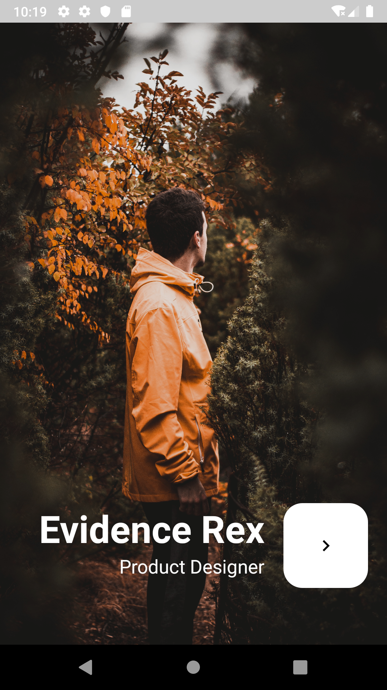
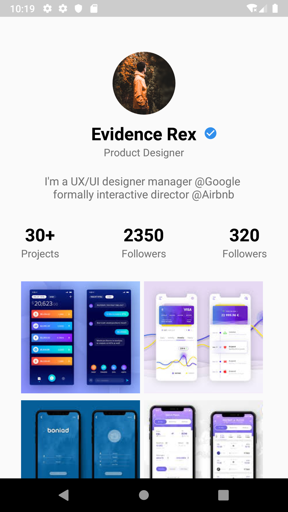

#DesignerProfile

A basic two screen static ui application. Inspiration from UpLabs

## 📸 Screenshots

| First Screen| Second Screen|
|------|-------|
|||

Feel free to make any changes or updates

## ✨ Requirements
* Any Operating System (ie. MacOS X, Linux, Windows)
* Any IDE installed that supports the Android SDK (ie. IntelliJ, Android Studio, Eclipse etc)
* A little knowledge of Java
* A brain to think 🤓🤓
